# Wine Cellar Manager version 1.0.0

This integration offers a tool and dashboard card to manage several wine cellars locally.

I strongly recommend using the card in its own dashboard, using the "Panel" layout (a single card on that dashboard).

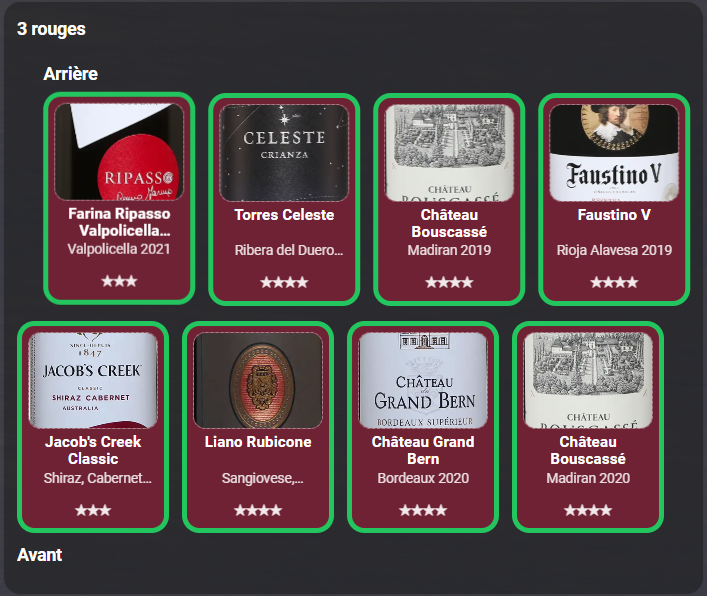

I created the integration because no solution currently available did exactly what I wanted to do. The "Wine cellar" integration simply didn't work on my server, and the "Wine Tracker" app, while beautiful and full-featured, doesn't organize wines as a visual equivalent to their physical location. It's a tracker, not a cellar representation. Other apps, not part of Home Assistant, often rely on subscriptions or add unwanted features while not excelling at what I actually needed.

The benefit of Wine Cellar Manager, beyond its simplicity, lies in its ability to physically represent a cellar while showing sufficient information. I built it by thinking about what I actually want to do and how I like interacting with my physical and virtual cellar.

I created this integration first for my personal use, but I'm happy to share it with anyone interested. Use it as is, feel free to comment, and recommend new features or bug corrections!

## Installation and configuration

### Step 1: Install via HACS (Custom Repository)
Since this integration is not yet part of the HACS default store, you must add it as a Custom Repository:
1. In your Home Assistant interface, click on HACS in the sidebar.
2. Click on the three dots in the top right corner and select Custom repositories.
3. Paste the URL of this GitHub repository into the Repository field.
4. Select Integration in the Category dropdown menu, then click Add.
5. Find the newly added Wine Cellar Manager card in HACS, click on it, and select Download.
6. Restart Home Assistant to load the integration.

### Step 2: Set up the Integration
1. Go to Settings > Devices & Services in Home Assistant.
2. Click +Add Integration in the bottom right corner.
3. Search for Wine Cellar Manager and click on it to begin configuration.
4. The integration proposes default paths for label images which should not be changed without reason. 
5. Enter your Gemini API key and the Gemini model name when requested (see below).

Lastly, it asks for the name of the Gemini model. For now, `gemini-2.5-flash` is the most robust, offers free daily tokens (sufficient to build a reasonable cellar) and is more effective than newer models which only offer free tiers in their "lite" modes (which are not as effective). For now, the integration doesn't do anything with a different model, so just leave it as is.

### Step 3: Add the Lovelace Card
Once the integration is installed, create a new dashboard with a Panel (1 card) layout view, click Add Card, select Manual Card, switch to the YAML editor, and simply paste:

```yaml
type: custom:wine-cellar-card
```

Save and Wine Cellar Manager will be ready for you!

### Obtaining a Gemini API Key

A Gemini API key can be used regardless of the model selected, but some may require payment information. Using `gemini-2.5-flash` is free but has daily limits. It's sufficient for Wine Cellar Manager and, as such, I did not implement any other AI option. Note that `gemini-2.5-flash`, like any AI, is far from perfect and can hallucinate or pull erroneous information. For most things it's reliable, but use with caution.

Getting a Gemini API key is completely free and takes just a few minutes using Google AI Studio.

- Go to the [Google AI Studio](https://aistudio.google.com/welcome) and log in using your Google account.
- Accept the Terms of Service if it is your first time using the platform.
- Click **Get API key** in the left-hand sidebar.
- Click **Create API key**.
- Select or create a Google Cloud Project when prompted, then click **Create key**.
- Copy your API key and store it securely.

## Main characteristics of Wine Cellar Manager

- Unlimited number of unique cellars which can be named individually. Background colors can be assigned to each cellar for aesthetic purposes and visual differentiation.

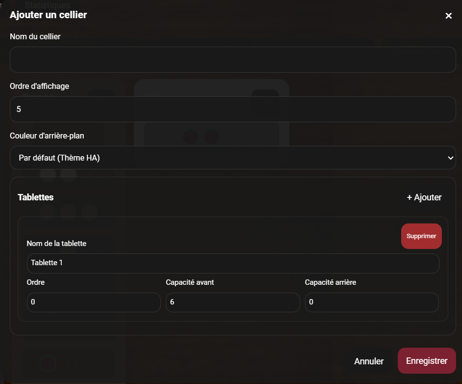

- Each shelf of each cellar can be individually configured: front and/or back rows + number of bottles per row. This lets users adapt to cellars which can have moving racks at the top and fixed shelves at the bottom, for instance. Each shelf can be named individually.

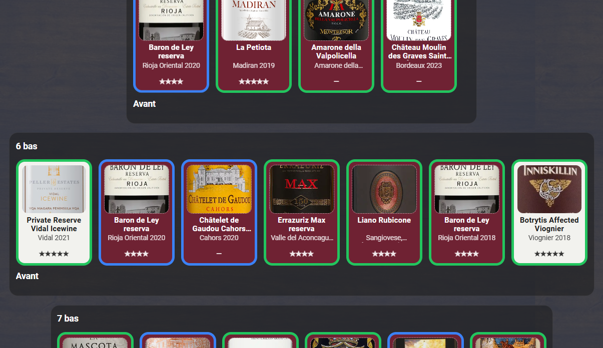

- Intelligent Storage Optimization: If you have multiple identical bottles (same name and producer), the integration automatically links them to a single shared label image on your server disk, preventing storage duplication when cloning or adding similar wines.

- Each bottle can be fully characterized with:
  - name (the only mandatory field)
  - label (JPG, PNG, WEBP, or GIF)
  - type from list (red, white, sparkling, rosé, orange, sweet or other)
  - varietals (the GUI handles complex varietal assemblies and replaces them with "Blend" as needed in Cellar view)
  - vintage
  - producer
  - region
  - country
  - beginning and ending of aging period
  - price
  - service temperature
  - alcohol concentration
  - personal rating
  - personal notes
  - clickable URL (default is SAQ.com, but any URL can be used)

- There are four views: Cellar, Compact, All Bottles, and Statistics.

## Cellar view

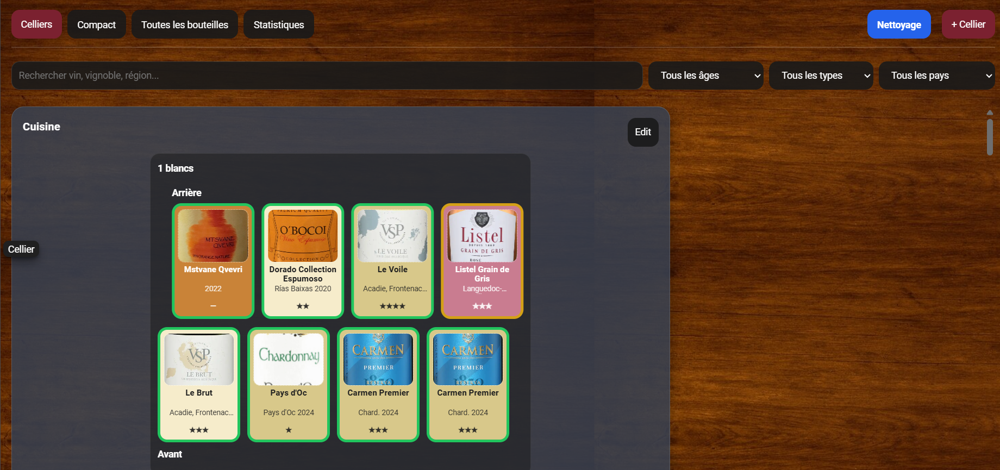

This is the default view. It shows a visual representation of all the cellars with useful information about each bottle. Each cellar has an Edit button at the top right.

Each shelf is represented in the order they have been set within a cellar (can be modified). Shelves with front and back rows are shown together, with the back row offset (representing how a physical shelf is actually configured).

The bottles are shown as cards. Each card is colored according to the type of wine and displays the label image (if available), the name, the varietal (or region if the country is France), and the rating.

Each card also has a colored frame showing the aging status:
- **Blue**: too young
- **Green**: ready to drink
- **Orange**: peak (current year = last year of aging period)
- **Red**: past peak
- **Gray**: not set

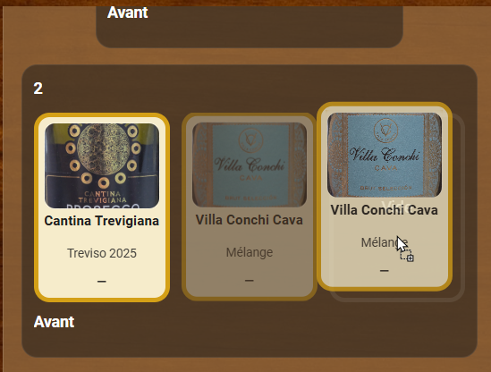

Individual cards can be dragged and dropped at will. Bottles can be moved to an empty slot or swapped. This works seamlessly on PC, tablet, or mobile. This is, again, to duplicate how people physically interact with a cellar. It also works in the compact view.

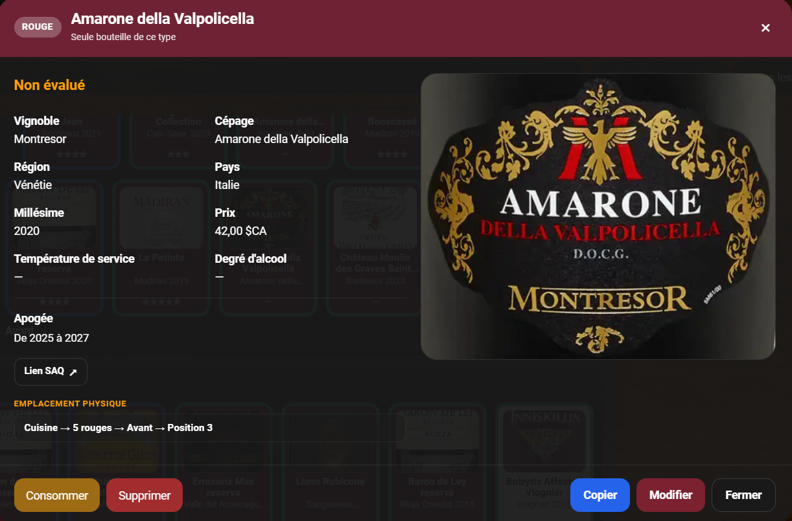

Clicking on a card opens the Bottle View. This shows detailed information about this particular bottle. This is where the URL link appears. The physical location of the bottle (cellar, shelf, row, position) is also shown. There are buttons to Delete (all information removed from memory) or Consume (the bottle is removed from the cellar, but information remains for future use if a similar bottle is later added). There is an Edit button (see below) and a Copy button, which temporarily puts the bottle data in memory and closes the view. Clicking on an empty spot automatically copies all the fields into this new slot, making it quick to add a second similar bottle.

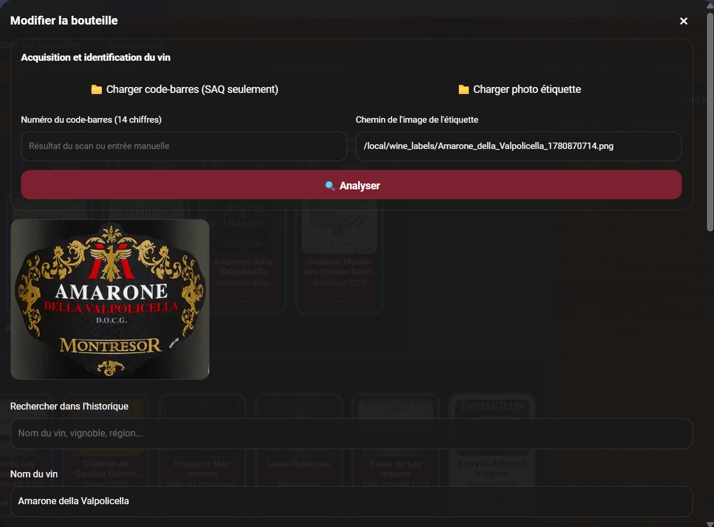

The Edit button brings up a new window. Each field can be filled at will, with only Name being required. Autocomplete (by looking at existing and consumed wines) is active for name, producer, varietal, region, and country. There is also an option to directly search the history by typing any of the main fields. The UI will recommend options which can be selected for auto-fill.

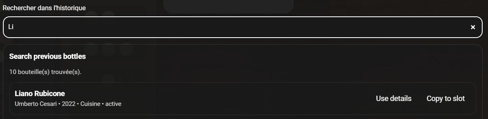

At the top of the Edit view is the option to upload the label image or a barcode image. The label image can be analyzed by Gemini to fill the bottle fields. If no label is present but a barcode image exists, clicking Analyze will ask Gemini to extract the barcode string. Once that string exists (either created by Gemini or entered manually by the user), clicking Analyze will have Gemini look at SAQ.com to determine the wine name and fill the bottle fields. The barcode image is then deleted to preserve storage. 

## Compact view

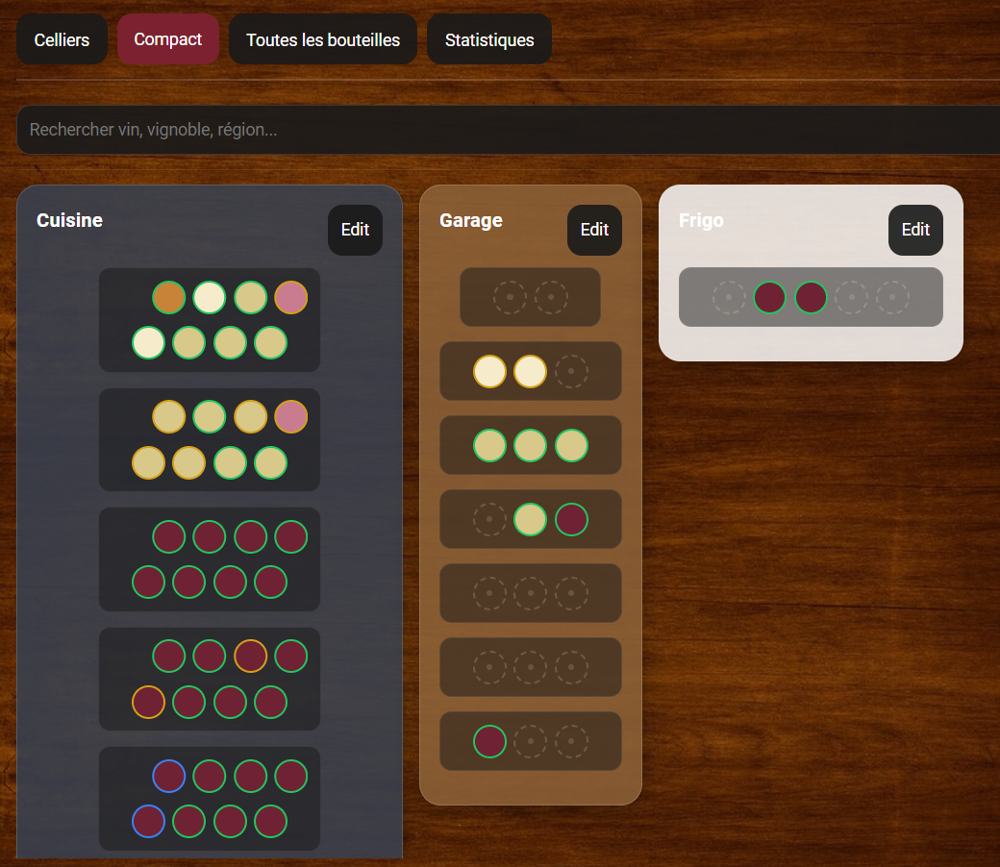

The compact view entirely duplicates the features of the Cellar view. The only difference is that bottles are represented by type-colored circles with aging status rings. Apart from the bottle representation, this view is functionally identical to the Cellar view. It is particularly useful on mobile or to have a denser overview of several cellars. If the screen allows it, the card will put cellars side-by-side. This view is closer to what is typically seen in a cellar manager app.

## All bottles

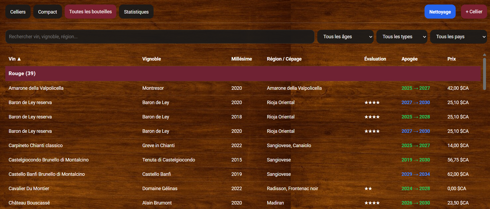

This view is essentially a table view of all current bottles, grouped by type. It allows sorting in ascending or descending order for any column. Clicking a line brings up the same Bottle view as with the Cellar and Compact views.

## Statistics

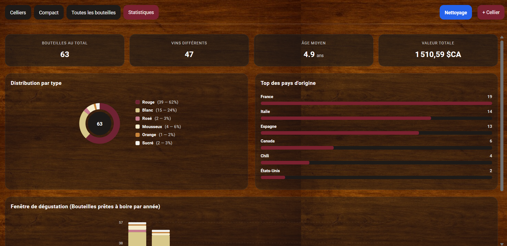

This view shows various information and statistics for the current inventory, including how many bottles reach their peak each upcoming year.

## Header controls

Each view offers two main buttons:

- **+Cellar**: Opens a window allowing the creation and configuration of a new cellar. It is the same view as the one for editing a cellar.

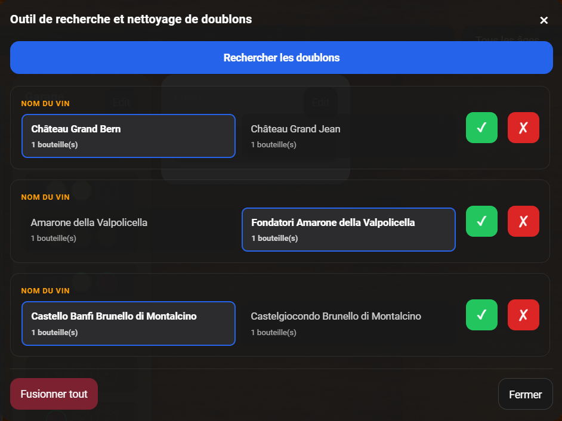

- **Cleanup**: A very useful tool. It analyzes the whole inventory and identifies possible duplicates (for instance, with similar but not identical names, or misspelled varietals). For each case, it will propose a fix, letting the user decide which of the possible duplicates should be retained.

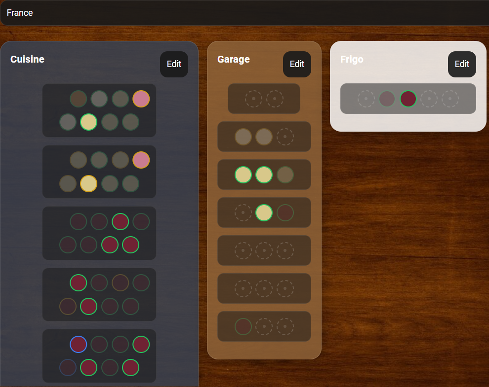

In each view except Statistics, there are also filtering options. First, there is a search field.

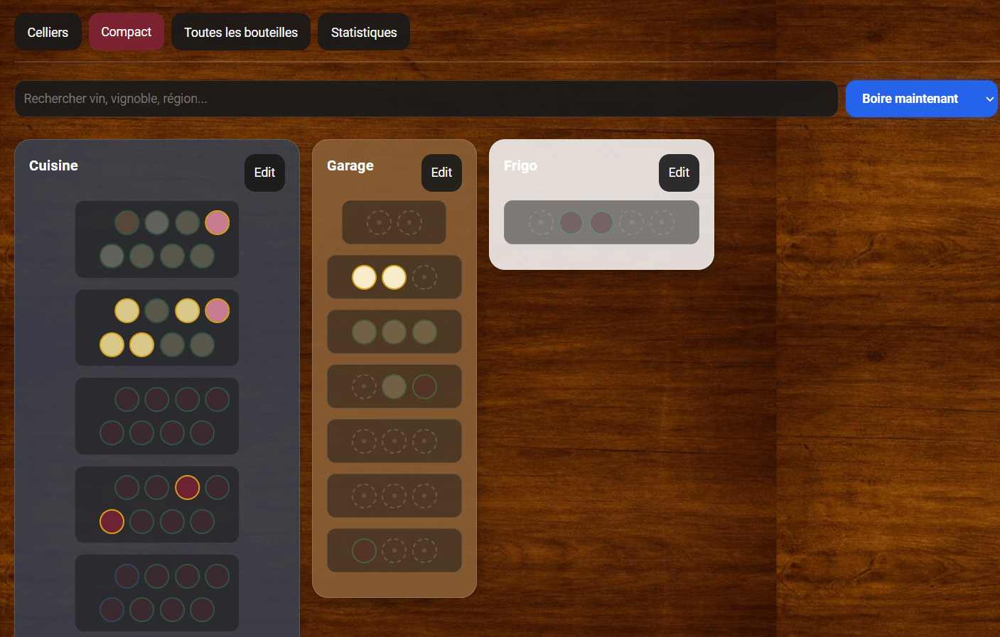

Second, there is a dropdown letting the user filter for bottles which are "Ready to drink" (highlights bottles whose "aging start" and "aging end" years cover the current year) or "Drink now" (bottles having reached their final peak year). 

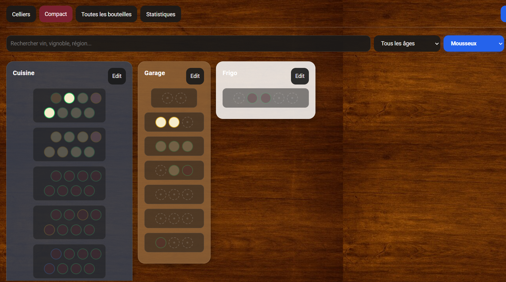

There are also two drop-down boxes letting the user filter by wine type or country.

## GUI details

- **Smart Column Balancing**: Automatically centers shorter shelves within the cellar volume to provide a clean, symmetrical layout.
- **Dynamic Mobile Adaptability**: Cellars scale beautifully to 100% of the screen width in portrait mode, while individual shelves retain fluid horizontal touch scrolling to maximize space.
- **Responsive Landscape Flow**: Automatically displays multiple cellars side-by-side on mobile landscape orientation, tablets, or wider PC monitors if screen real estate allows.
- **Theme Native**: Fully adapted and tested for both Home Assistant Light and Dark themes with automated text and border contrast shifting.
- **Optimized Real Estate**: Keeps the header section anchored on larger screens but hides structural padding on smaller phone viewports to preserve usability.
- **State Persistence**: Remembers your scroll position inside the dashboard even after minor interface refreshes.

## Notes
1. Large parts of the code were debugged, optimized, and refactored using advanced AI collaborative engines.
2. This integration was built primarily in French and translated during development. Some language quirks may remain.
3. This integration was built primarily for personal use. As such, some references relate to Québec (Canada), such as automatic CAD pricing conversions and native lookups on the state-owned alcohol monopoly "SAQ.com".

## Known bugs and To Do

- Barcode recognition does not work flawlessly for the moment due to image angle variations.
- Add a toggle in the Integration Options configuration to specify a custom domain or alternative source instead of SAQ.com for the default AI lookup analysis.